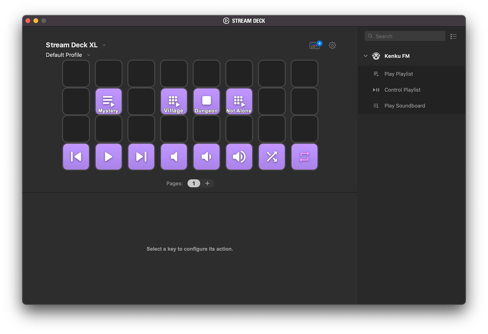

# Kenku FM Stream Deck Plugin

[Stream Deck](https://www.elgato.com/en/stream-deck) plugin for [Kenku FM](https://kenku.fm).

  

## Docs

Docs on using the plugin can be found [here](https://www.kenku.fm/docs/using-kenku-remote).

## Licence

Kenku FM is licensed under the GNU General Public Licence v3.0.

## Contributing

For our own wellbeing Kenku FM follows a similar contribution policy projects like [Litestream](https://github.com/benbjohnson/litestream#open-source-not-open-contribution).

This means we are open to pull requests for bug fixes only. Pull requests for new features will not be accepted due to the burden of maintaining these features into the future.
